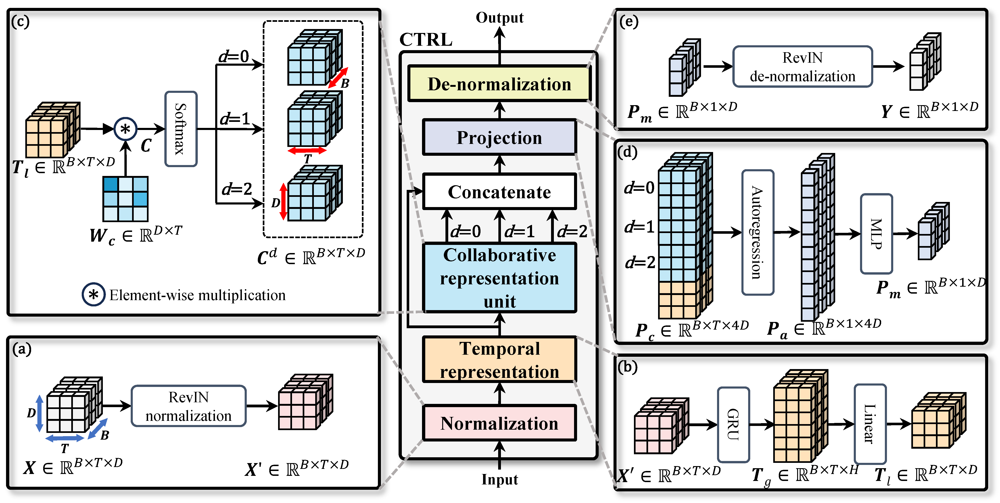

<div align="center">
  <h2><b> (EITCE'2024) CTRL: Collaborative Temporal Representation Learning for Wind Power Forecasting </b></h2>
</div>

<div align="center">

**[<a href="https://doi.org/10.1145/3711129.3711336">Doi</a>]**
**[<a href="eitce2024-Hu%20(CTRL%20Collaborative%20Temporal%20Representation%20Learning%20for%20Wind%20Power%20Forecasting).pdf">PDF</a>]
**[<a href="https://scholar.google.com.hk/citations?user=3BZDW4oAAAAJ">Google Scholar</a>]**

</div>

The complete implementation of the **CTRL** model is provided in [**model_ctrl.py**](model_ctrl.py) within this repository.

## Updates

🚩 **News** (2025.08): TCOAT has been included in [[**pyFAST**]](https://github.com/freepose/pyFAST). For implementation
details, see the [**TCOAT model code**](https://github.com/freepose/pyFAST/blob/main/fast/model/mts/coat.py) in pyFAST's
MTS module.

## Overall Architecture



## Requirements

- Python 3.10+
- PyTorch 2.0.0+

## Contact

If you have any questions or suggestions, feel free to contact me at [yuehu.xm@gmail.com](yuehu.xm@gmail.com).

## Citation

If you find this work useful in your research, please use the following citation formats:

**BibTeX formats:**

```bibtex
@inproceedings{pro/eitce2024/Hu,
    author = {Yue Hu and Senzhen Wu and Yu Chen and Xinhao He and Zihao Xie and Zhijin Wang and Xiufeng Liu and Yonggang Fu},
    title = {{CTRL}: Collaborative Temporal Representation Learning for Day-ahead Wind Power Forecasting},
    booktitle = {Proceedings of the 8th International Conference on Electronic Information Technology and Computer Engineering},
    doi = {10.1145/3711129.3711336},
    publisher = {{ACM}},
    year = {2024},
    month = {10},
    address = {Haikou, China},
}
```

**APA/Plain formats:**

```
Yue Hu and Senzhen Wu and Yu Chen and Xinhao He and Zihao Xie and Zhijin Wang and Xiufeng Liu and Yonggang Fu. CTRL:
Collaborative Temporal Representation Learning for Wind Power Forecasting. ACM EITCE
2024, https://doi.org/10.1145/3711129.3711336
```
